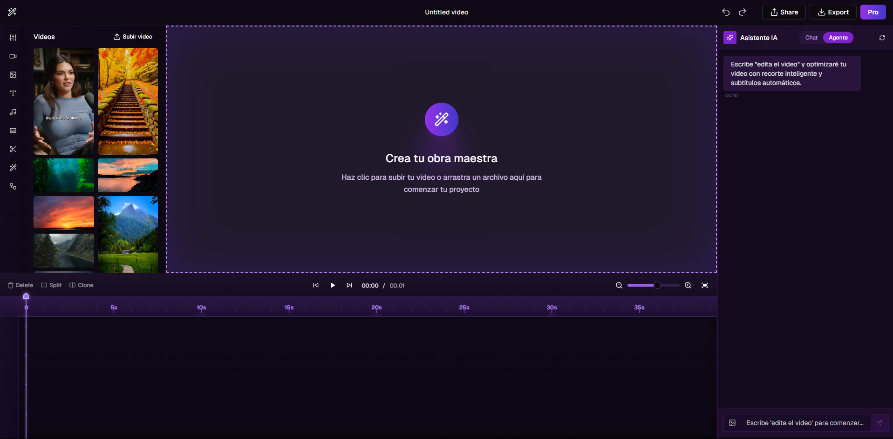

<div align= "center">
    
    <h1>Multimodal AI Video Agent</h1>

[](./LICENSE)

</div>

<p align="center">
  <a href="#quick-start">Quick Start</a> •
  <a href="#multimodal-capabilities">Multimodal Capabilities</a> •
  <a href="#installation">Installation</a> •
  <a href="#development">Development</a>
</p>

# AIlice Multimodal

This is an enhanced version of AIlice, a fully autonomous, general-purpose AI agent originally developed by MyShell AI. This fork adds comprehensive multimodal capabilities with a focus on video input/output and video editing functionalities.

## Original Project Credits
This project is based on [AIlice](https://github.com/myshell-ai/AIlice) by MyShell AI. All core functionality credit goes to the original developers. The multimodal capabilities are an extension built on their excellent foundation.

## Features

### Base Features (from original AIlice)
- **In-depth research capabilities** on specialized subjects
- **Advanced automation in programming and script execution**
- **Voice interaction support**
- **Compatibility with open-source models** and seamless integration with commercial models
- **Natural and fault-tolerant Interactive Agents Call Tree architecture**
- **Self-expansion capabilities** through dynamically loaded modules

### New Multimodal Capabilities
- **Video Input Processing**: Analyze and understand video content
- **Video Output Generation**: Create video content based on prompts
- **Video Editing**: Cut, trim, merge, and apply effects to videos
- **Video Transcription**: Convert speech in videos to text
- **Video Search**: Find and retrieve relevant sections in videos
- **Video Summarization**: Generate concise summaries of video content

## Quick Start

```bash
git clone https://github.com/YOUR_USERNAME/AIlice.git
cd AIlice
pip install -e .
ailice_web --modelID=anthropic:claude-3-5-sonnet-20241022 --contextWindowRatio=0.2
```

## Multimodal Capabilities

Here are some example commands you can try with the new multimodal capabilities:

- **"Analyze this video and tell me what's happening in it."** - Uploads and analyzes video content
- **"Trim this video from 1:20 to 3:45 and save it as highlight.mp4."** - Basic video editing
- **"Extract all spoken content from this YouTube video."** - Video transcription
- **"Create a 30-second video summary of this 10-minute presentation."** - Content summarization
- **"Find all scenes in this movie where the main character appears."** - Content search
- **"Add background music and titles to my video."** - Enhanced editing

## Installation

### System Requirements

- The multimodal functionality requires additional dependencies:
  - FFmpeg for video processing
  - At least 8GB RAM for basic video tasks
  - GPU recommended for video generation tasks

### Installation Steps

```bash
# Standard installation
git clone https://github.com/YOUR_USERNAME/AIlice.git
cd AIlice
pip install -e .
```

### Multimodal Module Configuration

Edit your config.json to add multimodal module settings:

```json
"services": {
  "video_processor": {
    "cmd": "python3 -m ailice.modules.AVideoProcessor --addr=tcp://127.0.0.1:59100",
    "addr": "tcp://127.0.0.1:59100"
  }
}
```

## Usage

```bash
# Start AIlice with multimodal capabilities
ailice_web

# With specific model
ailice_web --modelID=anthropic:claude-3-5-sonnet-20241022 --contextWindowRatio=0.2

# For video editing specialized agent
ailice_web --prompt="video_editor"
```

## Development

The multimodal capabilities are implemented through new modules in the established AIlice framework:

- `AVideoProcessor.py`: Core video processing and editing capabilities
- `prompts/APromptVideoEditor.py`: Specialized agent for video editing tasks
- `core/video/`: Directory containing video processing utilities

Follow the original AIlice development standards when contributing to this project.

## Future Development

Future plans for multimodal capabilities include:
- Integration with professional video editing tools
- Support for real-time video streaming processing
- Video generation through diffusion models
- Auto-captioning and subtitle generation

## License

This project is licensed under the same license as the original AIlice project.

## Attribution

AIlice Multimodal is built upon the original AIlice project by @stevenlu137 & original repo https://github.com/myshell-ai/AIlice


